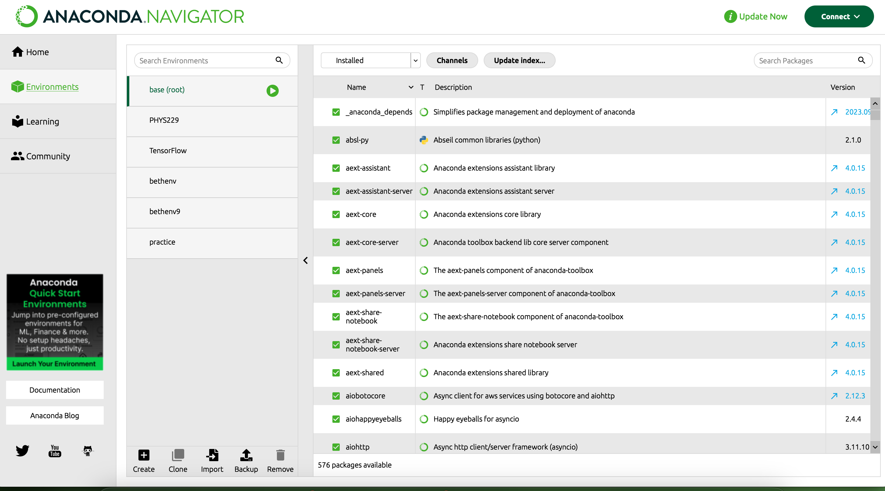
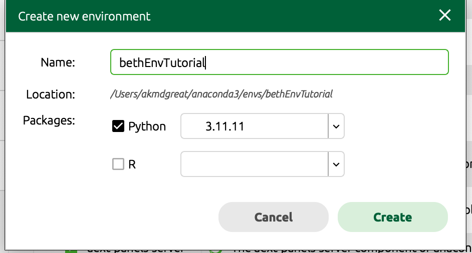
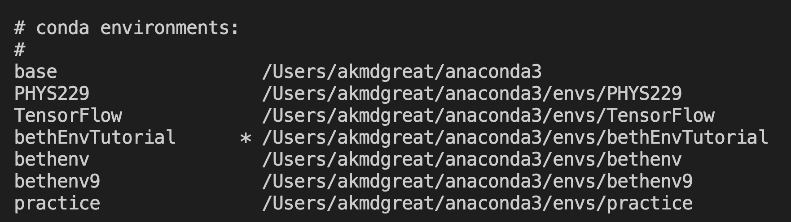

# Robust PSD Estimation for LISA

*Akshat, August 2025*

This repo contains the results and analysis from my summer project. If you want to understand the project, you can read about it [here](technical_report/Robust_PSD_estimation_technical_report.pdf).

_Note_: If you just want to use the glitch simulation tools, I recommend using [William's code](https://github.com/wmostrenko/LISASimulation). It's clean and easy to use. However, if you want to improve on PSD estimation algorithms, you can use my code.

## Code

This directory includes all the important code I wrote over the summer, as well as the files and directories necessary for it to run. The main directories are:

- **BethLISA**: Modified code by [Beth Flanagan](https://github.com/bconc/bethLISA). I cleaned up the code and fixed small bugs. Instructions for using it can be found in Beth's repo.
- **AkshatLISA**: Contains the code I implemented for my summer project.

For the code in the `AkshatLISA` directory, the most important files and folders are:

- `analysis_notebooks/report_plots.ipynb`: Contains all the plots for the final report. If you’re just starting out, this is a good place to begin.
- `scripts/pdf.py`: Implementation of the probability density functions for mean- and median-based methods.
- `scripts/psdNoise.py`: Code for generating noise realizations of a time series with a given PSD (power spectral density).
- `psd_estimation_methods`: Implementation of the three PSD estimation algorithms (WOSA, LPSD, LogPSD).
- `injecting_mbbh`: Code for injecting MBBH (Massive Black Hole Mergers) into the simulated TDI noise.

Most of the files outside the ones mentioned above are helper functions. Some contain analyses I used to better understand the problems and test out potential solutions.

## Installation Guide

### Step 1: Enable a virtual environment

Think of a virtual environment as a “container of libraries.” If you are working on multiple Python projects requiring different package versions, you need a way to keep them separate. Plus, it’s good practice. There are several ways to enable a virtual environment—here’s my favorite method:

- Download [Anaconda Navigator](https://www.anaconda.com/products/navigator).
- Tap **Environments** from the left sidebar

- Tap **Create** from the bottom left corner:

- Choose the environment name and Python version (I use Python 3.11.11, which works fine for me).

- Type `conda info --envs` in a terminal to see a list of environments.
- Type `conda deactivate` to deactivate the base environment (usually active by default), and then `conda activate bethEnvTutorial` (or whatever your environment name is) to activate your environment. Now, when you type `conda info --envs`, you’ll see a star next to the activated environment.

### Step 2: Clone the repo

- Create a folder and clone the repo by running:  
  `git clone https://github.com/AkmDgreat/AkshatLISA.git`
- **Weird Step**: Ask Dr. Scott Oser (or Akshat, or William) for LDC code. Why? Because we don’t have access to it, but it’s required to run Beth’s code. Once you have it, place it in your project directory.
- You’ll also need Kye’s code in your directory: [https://github.com/0Strategist0/KyeLDC](https://github.com/0Strategist0/KyeLDC).
- Run `pip install -r requirements.txt` to install the packages. If you run into linker issues or C/C++ errors, see Step 6 in [AkshatLISA/injecting_mbbh/downloading_bbhx.md](AkshatLISA/injecting_mbbh/downloading_bbhx.md).
- If you want to inject MBBH to LISA noise, see the instructions [here](AkshatLISA/injecting_mbbh/downloading_bbhx.md).