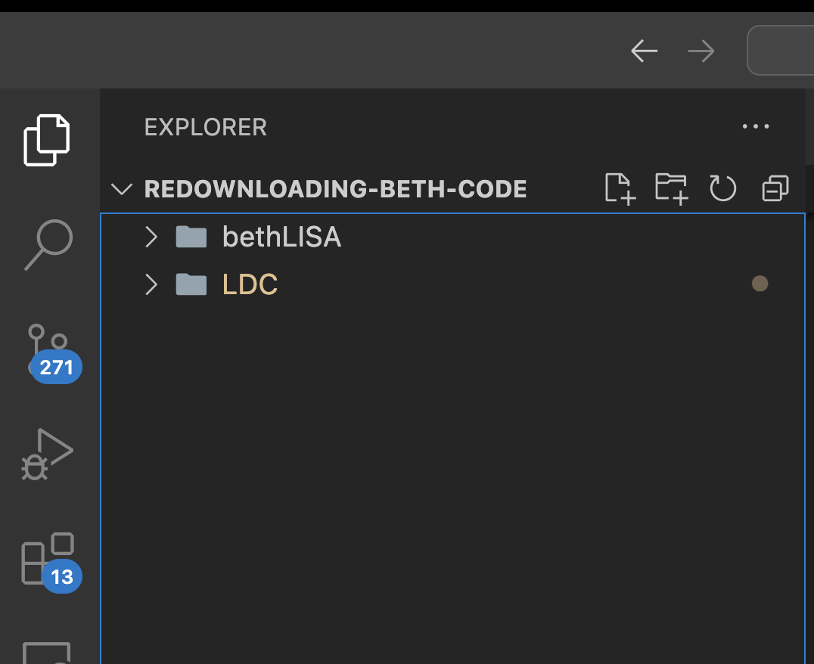

# Downloading Beth's code

These are instructions for downloading Beth's code (https://github.com/bconc/bethLISA)

### Step-1 Enable a virtual environment

Think of a virtual environment as a "container of libraries". If you are working on multiple Python
projects requireding different versions package versions, you need a way to keep them separate.
Plus its a good practice. There are several ways to enable a virtual environment, here's my
favourite method:

- Download Anaconda Navigator (https://www.anaconda.com/products/navigator)
- Tap "environments" from the left sidebar:

- Tap "Create" from the bottom left corner:

- Choose the environment name and Python version (I use Python 3.11.11, and it works fine for me)

- Type `conda info --envs` in a terminal to see a list of Environments.

- Type `conda deactivate` to deactivate the base environent (usually, its activated by default), and then
  `conda activate bethEnvTutorial` (whatever your environment name is) to activate the environment. Now when you type
  `conda info --envs`, you will see a star in front of the activated environment

### Clone Beth's repo

- Create a folder and clone Beth's repo by running `git clone https://github.com/bconc/bethLISA.git`

### Setting up requirements.txt

- Weird Step: Ask Dr Scott Oser (or Akshat, or William) for LDC code. Why, you might ask? because we don't have
  access to this code, but we need it to run Beth's code. Once you have it, place it in your project directory:

- Go to `requirements.txt` and replace line-74 which is `lisa-data-challenge==1.2.2` with the absolute path
  to the LDC directory, for me it is: `/Users/akmdgreat/Desktop/LISA/redownloading-beth-code/LDC`

- Make sure you are in `bethLISA` directory in the terminal (run `cd bethLISA` if you are not), and run `pip install -r requirements.txt`

### Common Errors and troubleshooting

- If you get a gsl related error like `gsl-config: command not found`, run `brew install gsl`

- If you get some weird errors, try this:

1. `echo $CONDA_PREFIX`: this should print something like `/Users/akmdgreat/anaconda3/envs/bethEnvTutorial`
2. `export CPPFLAGS="-I${CONDA_PREFIX}/include"`
3. `export LDFLAGS="-L${CONDA_PREFIX}/lib"`

- While reading through "https://github.com/mikekatz04/BBHx?tab=readme-ov-file", I came across this useful advice:

"To install this software for CPU usage, you need gsl >2.0 , lapack (3.6.1), Python >3.4, and NumPy. If you install lapack with conda, the new version (3.9) seems to not install the correct header files. Therefore, the lapack version must be 3.6.1. To run the examples, you will also need jupyter and matplotlib. We generally recommend installing everything, including gcc and g++ compilers, in the conda environment as is shown in the examples here. This generally helps avoid compilation and linking issues. If you use your own chosen compiler, you will need to make sure all necessary information is passed to the setup command (see below). You also may need to add information to the setup.py file."